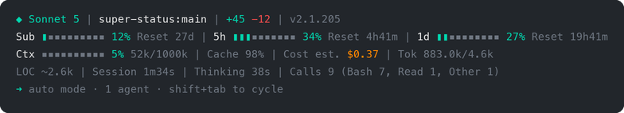

# super-status

A combined Claude Code statusline — identity, context usage, session quality, plan-limit tracking, and (optionally) live tool activity, running subagents, and todo progress, in labeled lines at the bottom of every session.



## Requirements

Supported platforms: **macOS**, **Linux**, and Windows via **WSL** or **Git Bash** (plain Windows without a bash environment is not supported — this is a bash script by design).

| Binary | Required? | Used for |
|---|---|---|
| `bash` | required | the script itself |
| `jq` | required | stdin/config JSON parsing |
| `python3` | required | transcript parsing (`Total Tokens:`, `Tool Calls:`, `Activity:`, `Agents:`, `Todo:`) — ships by default on macOS and most Linux distros |
| `git` | recommended | branch, dirty/ahead-behind markers |
| `tokei` | optional | the `Lines of code in project:` field |
| `curl` | optional | the OpenRouter `Balance:` line (Mode 3 only) |

```
brew install jq
brew install tokei
```

## Install

### Option A — as a Claude Code plugin (three in-session commands)

```
/plugin marketplace add orassayag/super-status
/plugin install super-status
/super-status:setup
```

The `setup` command copies the script into `~/.claude/super-status/`, makes it executable, and patches `statusLine` in `~/.claude/settings.json` for you (backing the file up first).

### Option B — one command from a clone

```
git clone https://github.com/orassayag/super-status.git
cd super-status
bash install.sh
```

`install.sh` does the same copy + chmod + settings patch, resolving your home directory itself — no placeholder paths to edit. It preserves an existing `refreshInterval` and defaults it to `2` otherwise.

### Option C — manual fallback

```
mkdir -p ~/.claude/super-status
cp statusline.sh ~/.claude/super-status/statusline.sh
chmod +x ~/.claude/super-status/statusline.sh
```

Then add this to `~/.claude/settings.json` (create the file if it doesn't exist), with your actual home directory in the path:

```
{
  "statusLine": {
    "type": "command",
    "command": "/bin/bash /home/YOUR_USER/.claude/super-status/statusline.sh",
    "refreshInterval": 2
  }
}
```

This is the **user-level** settings file, so it applies to every project automatically — no per-project setup needed. `refreshInterval` (seconds) is optional but recommended — see **Live updates** below for why.

### Open a new Claude Code session

The statusline configuration is read at startup — it won't appear in a session that was already running when you edited `settings.json`. Close your current session and open a new one.

If it still doesn't appear after that, Claude Code may be waiting for workspace trust to be accepted for your working directory. Run `claude` once in that directory and accept the trust prompt when asked, then restart again.

**Quick test without Claude Code:**

```
echo '{"model":{"display_name":"Opus"},"workspace":{"current_dir":"/home/you/myapp"},"context_window":{"used_percentage":25}}' \
  | bash ~/.claude/super-status/statusline.sh
```

If you see formatted, labeled lines with colors, it's working. (Fields that need a live session — like rate limits, token totals, or `Tool Calls:` — won't show with this minimal mock payload; that's expected, see "What each field means" below.)

## Output format

super-status prints labeled lines rather than a dense symbol-only layout, so every value is self-explanatory at a glance. The exact number of lines shown depends on the backend mode (see **Backend modes** below) and your configuration, but the labels and their order are always the same.

**Mode 1 — Anthropic subscription (7 lines by default):**

```
Model: Claude Sonnet 4.6 | Repo: repo | Branch: master | Lines Changes: +45 -12 | Claude Version: v2.1.90
Subscription: 62% [############--------] (Reset: 14d [14/08/2026])
Sessions: 5h: 99% [###################-] (Reset: 2h30m [12:40]) | 3d: 44% [########------------] (Reset: 3d14h10m [11/07/2026 15:00])
Context: 42% [########------------] (46k/200k) | Cost (est.): $1.23 | Total Tokens: 152.3k in / 45.2k out
Lines of code in project: ~14.2k | Total Session Time: 1h30m | Total thinking time: 1m38s
Cache Vs Tokens: 71% | Efficiency Grade (A–F): A(100)
Tool Calls (9): Skills: 1 | Code: 3 | Commands: 1 | Read: 3 | MCP Call: 0 | Other: 1
```

With `"preset": "full"` in the config (see **Configuration**), up to three more lines appear when they have something to show, and the `Branch:` field gains live git markers:

```
Model: Claude Sonnet 4.6 | Repo: repo | Branch: master* ↑2 !3 +1 ?2 | ...
...
Activity: ◐ Edit: auth.ts | ✓ Read ×3 | ✓ Grep ×2
Agents: ◐ Explore [haiku]: Finding auth code (2m15s)
Todo: ▸ Fixing authentication bug (2/5)
```

The `Subscription:` line needs a one-time setup step — see **Subscription tracking setup** below. Until then it's replaced by a bold red reminder line.

**Mode 2 — Anthropic API key / other pay-as-you-go (5 lines — Sessions and Subscription lines omitted):**

```
Model: Claude Sonnet 4.6 | Repo: repo | Branch: master | Lines Changes: +45 -12 | Claude Version: v2.1.90
Context: 42% [########------------] (46k/200k) | Cost: $3.42 | Total Tokens: 152.3k in / 45.2k out
Lines of code in project: ~14.2k | Total Session Time: 1h30m | Total thinking time: 1m38s
Cache Vs Tokens: 71% | Efficiency Grade (A–F): A(100)
Tool Calls (9): Skills: 1 | Code: 3 | Commands: 1 | Read: 3 | MCP Call: 0 | Other: 1
```

On a non-Anthropic backend (e.g. z.ai), the model segment carries an explicit provider badge: `Model: Claude Sonnet 4.6 [z.ai]`.

**Mode 3 — OpenRouter (6 lines — Sessions line replaced with a live Balance line):**

```
Model: anthropic/claude-sonnet-4.6 [OpenRouter] | Repo: repo | Branch: master | Lines Changes: +45 -12 | Claude Version: v2.1.90
Balance: $16.58 / $20.00 [################----] 17% used
Context: 42% [########------------] (46k/200k) | Cost: $3.42 | Total Tokens: 152.3k in / 45.2k out
Lines of code in project: ~14.2k | Total Session Time: 1h30m | Total thinking time: 1m38s
Cache Vs Tokens: 71% | Efficiency Grade (A–F): A(100)
Tool Calls (12): Skills: 1 | Code: 4 | Commands: 3 | Read: 2 | MCP Call: 2 | Other: 0
```

**Colors:** every progress bar (`Subscription:`, `Sessions: 5h:`, `Sessions: Nd:`, `Context:`, `Balance:`) is colored to match its own usage percentage — green while healthy, orange as it climbs, red once it's at or near the limit — rather than a flat, uninformative color. The thresholds are configurable (see **Configuration**).

**Dates:** the 5-hour reset shows a countdown plus `HH:MM` (e.g. `Reset: 2h30m [12:40]`), since that reset always lands within the current day. The weekly reset shows a countdown plus a full `dd/MM/yyyy HH:MM` timestamp (e.g. `Reset: 3d14h10m [11/07/2026 15:00]`), since it can land on a different day.

## Configuration

Everything is optional. With no config file, super-status renders its default layout; the new-in-2.0 elements (`Activity:` / `Agents:` / `Todo:` lines, git dirty/ahead-behind/file-stat markers) default **off**.

Create `~/.claude/super-status/config.json`. The quickest start:

```json
{ "preset": "full" }
```

A malformed config never breaks the render — defaults are used and a one-line bold red warning appears until it's fixed. Unknown keys are ignored.

### Full reference (every key, with its default)

```json
{
  "preset": "",
  "language": "en",
  "layout": "expanded",
  "bar_width": 20,
  "bar_filled": "#",
  "bar_empty": "-",
  "path_levels": 1,
  "max_width": 0,
  "context_value": "both",
  "display": {
    "model": true, "repo": true, "branch": true, "worktree": true,
    "lines_changed": true, "version": true, "provider": true,
    "git_dirty": false, "git_ahead_behind": false, "git_file_stats": false,
    "subscription": true, "sessions": true, "balance": true,
    "context": true, "cost": true, "total_tokens": true,
    "loc": true, "session_time": true, "thinking_time": true,
    "cache_ratio": true, "efficiency": true, "tool_calls": true,
    "activity": false, "agents": false, "todos": false
  },
  "git": {
    "push_warning_threshold": 3,
    "push_critical_threshold": 10
  },
  "colors": {
    "label": "", "model": "", "repo": "", "branch": "",
    "muted": "", "accent": "", "bar_filled": "", "bar_empty": ""
  },
  "thresholds": {
    "context_warning": 70, "context_critical": 90,
    "five_hour_warning": 70, "five_hour_critical": 90,
    "seven_day_warning": 50, "seven_day_critical": 75
  }
}
```

| Key | Meaning |
|---|---|
| `preset` | `full` (everything on), `essential` (identity + git + limits + context + todos/agents), or `minimal` (model, branch, context, sessions — compact layout). Applied first; every explicit key below still overrides it |
| `language` | Label language. Only `en` ships; all labels live in one block in the script, so adding a language is one `case` branch |
| `layout` | `expanded` (the default multi-line layout) or `compact` (3 lines for small panes — see **Compact layout** below) |
| `bar_width` | Progress-bar width in glyphs (5–60) |
| `bar_filled` / `bar_empty` | Bar glyphs — e.g. `"█"` / `"░"` |
| `path_levels` | How many trailing path components `Repo:` shows (1–5). `2` turns `Repo: client` into `Repo: acme/client`, disambiguating same-named folders |
| `max_width` | Truncate each line to this display width with a trailing `…` (ANSI- and UTF-8-aware). `0` = only truncate when `$COLUMNS` is exported to the script |
| `context_value` | What renders on the `Context:` segment: `percent`, `tokens`, `remaining` (tokens left before auto-compact — uses Claude Code's own `remaining_percentage` when present), or `both` |
| `display.*` | Per-field show/hide. Field names match the segment names under **Custom layout** below (plus `git_dirty` / `git_ahead_behind` / `git_file_stats` / `provider`, which are sub-toggles of `branch`/`model`) |
| `git.push_warning_threshold` / `push_critical_threshold` | Unpushed-commit counts at which the `↑N` marker turns orange / red |
| `colors.*` | Per-element color overrides: named ANSI (`red`, `cyan`, `grey`, `bright-blue`, `orange`, ...), 256-color numbers (`"208"`), or hex (`"#ff8800"`). Empty = built-in default |
| `thresholds.*` | Percentages at which the context / 5-hour / weekly bars turn orange (warning) and red (critical) |

### Compact layout

`"layout": "compact"` collapses the default multi-line output down to 3 lines for small terminal panes (cmux splits especially) — same fields, same colors, just packed onto fewer lines instead of the default `expanded` layout's 6–10:

```json
{ "preset": "full", "layout": "compact" }
```

```
Model: Claude Sonnet 4.6 | Repo: repo | Branch: master | Context: 42% [########------------] (46k/200k)
Subscription: 62% [############--------] (Reset: 14d [14/08/2026]) | Sessions: 5h: 99% [###################-] (Reset: 2h30m [12:40]) | 3d: 44% [########------------] (Reset: 3d14h10m [11/07/2026 15:00]) | Cost (est.): $1.23
Activity: ◐ Edit: auth.ts | ✓ Read ×3 | ✓ Grep ×2
```

Any line that ends up with nothing to show (e.g. `Sessions:`/`Balance:` both empty, or no agents/todos in flight) is omitted, so the actual line count can be 1–3 depending on backend mode and what's active. `layout` and `preset` are independent — `compact` works with any preset, including no preset at all.

### Custom layout

`lines` (an array of arrays of segment names) replaces the preset layout entirely — this is how you reorder segments or merge them onto shared lines:

```json
{
  "lines": [
    ["model", "branch", "context"],
    ["sessions", "balance"],
    ["todos", "agents"]
  ]
}
```

Segment names: `model`, `repo`, `branch`, `worktree`, `lines_changed`, `version`, `subscription`, `sessions`, `balance`, `context`, `cost`, `total_tokens`, `loc`, `session_time`, `thinking_time`, `cache_ratio`, `efficiency`, `tool_calls`, `activity`, `agents`, `todos`. Empty segments are dropped along with their separator, and fully empty lines are omitted — so listing `sessions` and `balance` on the same line is safe (only one ever renders).

### Kill switch

`SUPER_STATUS_DISABLE=1` makes the script exit silently for that session — no config changes needed. Useful for screenshots or debugging.

## Live updates

super-status is a stateless script — it only knows what Claude Code hands it on stdin *at the moment it's invoked*. That has a few visible effects that are Claude Code behavior, not bugs in this script:

- **The statusline disappears during permission prompts, autocomplete, and the help menu.** This is documented, intentional Claude Code behavior — it hides in those moments and reappears once you respond.
- **`Total Session Time` and `Total thinking time` can appear frozen.** By default, Claude Code only re-runs your statusline command after a new assistant message, after `/compact`, when the permission mode changes, or when vim mode toggles — there's no built-in per-second tick. So during a long thinking pause or while waiting on a tool call, both fields hold their last value until the next one of those events fires.
- **Rate-limit data (the `Sessions:` line) and cumulative session token totals (`Total Tokens:` on the Context line) are both empty until after your first message exchange in a session.** Claude Code only populates `rate_limits` and `context_window.total_input_tokens` / `total_output_tokens` once it's made at least one real API call — there's currently no way to see them before that (this is the single most-requested statusLine feature upstream, [tracked here](https://github.com/anthropics/claude-code/issues/27915)). If you see the `Sessions:` line appear without having typed anything yourself, it's because *something* triggered a background API call (e.g. reloading MCP servers rebuilds the system prompt and does a round-trip) — not because super-status found a way around the limitation.
- **The permission-mode indicator (`⏵⏵ auto mode on ...`) disappears while Claude is thinking.** That line is Claude Code's own footer, not part of super-status — Claude Code temporarily replaces it with the thinking spinner (`✻ ... esc to interrupt`) while a response is being generated, and it comes back when the turn ends. Normal, and nothing a statusline script can influence.
- **A `Sessions: 5h:` percentage above 100% (e.g. `108%`) is expected, not a bug.** Anthropic's own usage accounting can briefly overshoot the limit before Claude Code cuts a session off (e.g. a burst of concurrent or cached requests landing faster than the limit check). super-status prints the percentage exactly as reported rather than silently clamping it to 100 — only the bar's fill width is clamped, so the bar still reads as "full."
- **The `Activity:` and `Agents:` lines update when the transcript does.** In-flight markers (`◐`) appear as soon as Claude Code records the tool call and clear when its result lands; elapsed times on agents tick with each re-render, so `refreshInterval` makes them feel live.

To make the time fields update continuously instead of only on those events, add `"refreshInterval": 2` (or any value in seconds, minimum `1`) to the `statusLine` block in `~/.claude/settings.json` (the installers do this for you). This re-runs the script on a fixed timer in addition to the normal event triggers, so the clock keeps ticking even while Claude is idle or thinking. The script's warm-path render is a single `jq` pass over stdin plus cached transcript/git reads, so even `"refreshInterval": 1` is comfortable.

## What each field means

### Line 1 — Identity & changes

| Field              | Example             | Meaning                                                                |
| ------------------ | -------------------- | ----------------------------------------------------------------------- |
| `Model:`           | `Claude Sonnet 4.6`  | The model powering the current session. On a non-Anthropic backend a provider badge is appended (`[OpenRouter]`, `[z.ai]`, or the backend's hostname) |
| `Repo:`            | `repo`               | Current project folder name (`path_levels` shows more of the path)     |
| `Branch:`          | `master* ↑2 ↓1 !3 +1 ?2` | Current git branch, resolved from your working directory's git root. With the git toggles enabled: `*` = dirty working tree; `↑N`/`↓N` = commits ahead/behind upstream (`↑` colored by the push thresholds); `!N +N ?N` = modified / staged / untracked file counts (only non-zero ones shown). Refreshed at most every 10s |
| `Worktree:`        | `feature-xyz`        | Only appears if this session is running inside a git worktree          |
| `Lines Changes:`   | `+45 -12`             | Lines added/removed this session, taken directly from Claude Code's own `cost.total_lines_added`/`total_lines_removed` counters — updates immediately on every render, no caching. Only counts edits made by this session's own tools (not sub-agents running in their own sessions, and not nested-repo work outside the current one). Hidden if both are zero |
| `Claude Version:`  | `v2.1.90`             | Claude Code CLI version                                                |

### Line 2 — Subscription cycle (subscription mode only)

| Field           | Example                                              | Meaning                                                                                                                                                                                                                              |
| --------------- | ------------------------------------------------------ | ------------------------------------------------------------------------------------------------------------------------------------------------------------------------------------------------------------------------------------ |
| `Subscription:` | `62% [############--------] (Reset: 14d [14/08/2026])` | How far through your current monthly billing cycle you are, with days remaining (rounded up) and the renewal date. Cycles are true calendar months from your declared start date (14/07 renews on 14/08 — 28–31 days depending on the month; a start day missing from a shorter month, e.g. the 31st, clamps to that month's last day). Green early in the cycle, orange mid-cycle, red in the final ~2 days — informational progress, not a rate-limit warning. Requires the one-time setup in **Subscription tracking setup** below; until then a bold red reminder line appears at the very top instead |

### Line 3 — Sessions / Balance (backend-dependent — see Backend modes below)

| Field           | Example                                                                              | Meaning                                                                                                                                                                                                        |
| --------------- | ------------------------------------------------------------------------------------- | ----------------------------------------------------------------------------------------------------------------------------------------------------------------------------------------------------------- |
| `Sessions: 5h:` | `99% [###################-] (Reset: 2h30m [12:40])`                                   | % of your rolling 5-hour Anthropic plan limit used, a usage bar colored to match, and time until reset (countdown + clock time)                                                                              |
| `Sessions: Nd:` | `3d: 44% [########------------] (Reset: 3d14h10m [11/07/2026 15:00])`                 | % of your rolling weekly Anthropic plan limit used, a usage bar colored to match, and time until reset (countdown + full date/time). `N` is computed live — the actual number of days from now until the reset (rounded up) — not hardcoded to 7, since this window is rolling and doesn't always land exactly a week out |
| `Balance:`      | `$16.58 / $20.00 [################----] 17% used`                                     | (OpenRouter mode only) live remaining/total credit balance from OpenRouter's `/api/v1/credits` endpoint, bar colored to match usage                                                                          |

Colors: green = healthy, orange = getting close, red = at/near the limit (the weekly window uses tighter thresholds than 5-hour, since a blown weekly quota is more disruptive than a 5-hour one that resets soon — both are configurable). A percentage above 100% can happen (see **Live updates** above) — it's shown as-is rather than clamped, though the bar itself always reads as full.

### Line 4 — Context & cost

| Field      | Example                                 | Meaning                                                                                          |
| ---------- | ---------------------------------------- | -------------------------------------------------------------------------------------------------- |
| `Context:` | `14% [##------------------] (28k/200k)` | How full the context window is, with a usage-colored bar. Which value(s) render is configurable via `context_value` — `percent`, `tokens`, `remaining` (`(154k left)` — often the most actionable number late in a session), or `both` |
| `Cost:` / `Cost (est.):` | `$0.14`                    | Session cost in USD, always computed at standard API list rates. On API-key/OpenRouter mode this is real spend, labeled `Cost:`. On subscription mode you pay a flat monthly fee regardless, so the same number is only an API-equivalent estimate of what the session *would* have cost — labeled `Cost (est.):` to make that explicit |
| `Total Tokens:`  | `152.3k in / 45.2k out`            | Cumulative input/output tokens for the **whole session** — unlike the `Context:` figure, this doesn't reset after `/compact`. Both figures are computed by super-status itself, by summing every assistant message's usage fields out of the session transcript (input + cache-creation + cache-read tokens for `in`, output tokens for `out`), rather than trusted straight from Claude Code's own JSON — its `total_input_tokens` is unreliable early in a session and `total_output_tokens` only reflects the *last* exchange rather than a running total. Cached per `session_id`, re-parsed only when the transcript file's mtime changes. Empty until after your first message exchange (see **Live updates**) |

### Line 5 — Project & timing

| Field                       | Example | Meaning                                                                     |
| --------------------------- | ------- | ---------------------------------------------------------------------------- |
| `Lines of code in project:` | `~127`  | Approximate lines of code in the project (via `tokei`, refreshed every 60s) |
| `Total Session Time:`       | `1h30m` | Total session wall-clock time                                              |
| `Total thinking time:`      | `1m38s` | Cumulative time spent waiting on model responses this session              |

### Line 6 — Quality scores

| Field                              | Example  | Meaning                                                                                                                                        |
| ----------------------------------- | -------- | -------------------------------------------------------------------------------------------------------------------------------------------- |
| `Cache Vs Tokens:`                 | `71%`    | How much of your current context came from cache reuse vs. fresh tokens, as a plain percentage (green ≥75%, orange ≥40%, red below). Higher = cheaper/more efficient session. |
| `Efficiency Grade (A–F):`          | `A(100)` | Efficiency grade, based on how much code changed per *edit-capable* tool call (`Edit`, `Write`, etc. — read-only tools like `Read`/`Grep` don't count against it). Higher = more productive tool usage. Omitted entirely until the session has made at least one edit-capable call, rather than showing a misleading `F(0)` during exploration |

> **Note:** both metrics are *custom heuristics* built for this project, not official Claude Code metrics. They're a useful relative signal, not an absolute judgment of session quality.

### Line 7 — Tool Calls

| Field           | Example                                          | Meaning                                                                                                                                                                                                                  |
| --------------- | -------------------------------------------------- | --------------------------------------------------------------------------------------------------------------------------------------------------------------------------------------------------------------------- |
| `Tool Calls (N):`  | `Skills: 1 \| Code: 3 \| Commands: 1 \| Read: 3 \| MCP Call: 0 \| Other: 1` | Every tool call this session, parsed from the transcript and grouped into six semantic buckets (mapping below). `N` is the session's total tool-call count, and the six buckets always sum to exactly `N`. All six buckets always print, zeros included, so the line's shape stays stable as usage shifts |

The bucket mapping:

| Bucket     | Tool names that fall into it                                     |
|------------|------------------------------------------------------------------|
| `Skills`   | `Skill` (slash-command/skill invocations)                        |
| `Code`     | `Edit`, `Write`, `MultiEdit`, `NotebookEdit` (edit-capable tools) |
| `Commands` | `Bash` (shell/command execution)                                 |
| `Read`     | `Read`, `Glob`, `Grep`, `LS` (read-only/inspection tools)         |
| `MCP Call` | any tool name prefixed `mcp__` (third-party/MCP tool calls)      |
| `Other`    | anything not matched above (guaranteed catch-all — nothing silently disappears) |

Hidden entirely if no transcript is available yet, or before the session's first tool call.

### Lines 8–10 — Activity, Agents, Todo (off by default — enable via config)

| Field | Example | Meaning |
|---|---|---|
| `Activity:` | `◐ Edit: auth.ts \| ✓ Read ×3 \| ✓ Grep ×2` | Live tool activity, newest first: `◐` marks a tool call still in flight (its result hasn't landed in the transcript yet), `✓` marks completed calls — consecutive calls of the same tool collapse into one `×N` group, single calls show their target (file basename, command name, or search pattern). Hidden before the first tool call |
| `Agents:` | `◐ Explore [haiku]: Finding auth code (2m15s)` | Every subagent currently in flight (a `Task`/`Agent` tool call with no result yet): its type, model (when specified), task description, and elapsed time since launch. One segment per agent; the whole line hides when no agent is running |
| `Todo:` | `▸ Fixing authentication bug (2/5)` | The current in-progress item from the session's latest todo list, plus completed/total counts. Falls back to the next pending item when nothing is in progress; hides when no todos exist |

## Backend modes

super-status detects which backend you're running Claude Code against and adjusts the Sessions/Balance line accordingly. Detection is automatic — no configuration needed beyond your normal Claude Code setup.

### Mode 1 — Anthropic subscription

Detected when Claude Code's `rate_limits` data is present (i.e. you're authenticated against an Anthropic Max/Pro plan). Shows the `Sessions:` line with 5h/Nd usage, colored bars, and reset countdowns as described above, plus the `Subscription:` billing-cycle line (after the one-time setup below). `Cost:` is labeled `Cost (est.):` in this mode, since it's an API-equivalent estimate rather than real spend.

## Subscription tracking setup

The `Subscription:` line tracks how far you are through your current monthly billing cycle. It can't be automatic: Anthropic exposes no billing or renewal date anywhere in the JSON Claude Code hands to statusline scripts — so you declare your subscription start date once, in a `CLAUDE.md` file, and super-status derives every subsequent monthly cycle from it.

**Setup (one line, once):** paste this into your CLAUDE.md — either the project-local `CLAUDE.md` at the repo root, or the global `~/.claude/CLAUDE.md` — with your own date:

```
<!-- "subscription_start_date": "14/07/2026" -->
```

- The date **must be dd/MM/yyyy** (day first — `14/07/2026`, not `07/14/2026`), matching every other date this script prints.
- The HTML-comment wrapper is recommended so the line doesn't clutter the rendered doc, but it isn't required — the key is matched anywhere in the file (comment, code block, or plain text).
- A project-local `CLAUDE.md` takes priority over the global one, so you can override per project if needed.

**If the key is missing from both files**, a bold red reminder appears as the very first line of the statusline until you add it:

```
SUBSCRIPTION START DATE IS MISSING - ADD IT TO THE CLAUDE.MD: "subscription_start_date": "dd/MM/yyyy"
```

**If the key is present but the value isn't a real dd/MM/yyyy date** (wrong format, or an impossible date like `31/02/2026`), the same line appears with `INVALID` instead of `MISSING`. Note that an invalid value in the local file is reported as-is — it does **not** fall back to the global file, since a broken local value is almost certainly a typo you'd want to know about rather than silently mask.

**Once a valid date is found**, the warning disappears and the `Subscription:` line renders right below the identity line:

```
Subscription: 62% [############--------] (Reset: 14d [14/08/2026])
```

This whole feature is subscription-mode only — API-key and OpenRouter users have no monthly cycle to track, so for them there's no warning, no bar, and no CLAUDE.md reads at all.

### Mode 2 — Anthropic API key or other pay-as-you-go backend (e.g. z.ai)

Detected when `rate_limits` is absent. The `Sessions:` line is omitted entirely rather than showing empty or misleading data, because no backend in this mode currently exposes a programmatic balance check (confirmed against Anthropic's own API — there's no public endpoint for pay-as-you-go credit balance — and against z.ai's docs, which only offer a dashboard view). `Cost:` on the Context line remains the primary usage signal available in this mode.

### Mode 3 — OpenRouter

Detected via `$ANTHROPIC_BASE_URL` containing `openrouter.ai`. The `Sessions:` line is replaced with a **live `Balance:` line** pulled from OpenRouter's `/api/v1/credits` endpoint — both the remaining balance and the total are read live (never hardcoded), so top-ups are reflected automatically without any config changes. The bar is colored to match usage, same as the other modes.

**Requires:** an `OPENROUTER_API_KEY` environment variable available to the script (the same key you're already using for Claude Code's `ANTHROPIC_API_KEY`, or a separate one — either works, since it's only used read-only against the `/credits` endpoint, never logged or written anywhere). If this variable isn't set, super-status simply omits the `Balance:` line rather than erroring.

## A note on OpenRouter free models specifically

Everything above covers *paid* backends. If you're routing through OpenRouter to a free-tier model, a couple of things layer on top of Mode 3's behavior:

- **`Cost:` will show `$0.00`**, and the balance bar will barely move — accurate, just not very informative on a free model.
- **`Cache Vs Tokens:` may sit permanently low.** Most free/non-Anthropic models don't support Anthropic-style prompt caching, so the cache-reuse percentage stays near zero — that reflects the backend's capabilities, not the quality of your actual session.

General reliability note: Claude Code is built and tested against Anthropic's first-party API. Routing through OpenRouter — especially to free, non-Anthropic models — isn't officially guaranteed to behave identically, and tool-calling reliability in particular varies a lot by model. If things look inconsistent, that's more likely the backend than the statusline.

## Caches

Everything super-status derives (LOC counts, transcript parses, git status, the OpenRouter credits response) is cached under `${XDG_CACHE_HOME:-$HOME/.cache}/super-status/`, created with `0700` permissions — private to your user, unlike the world-readable `/tmp` location used before v2.0.0. It's always safe to delete the whole directory; everything in it is re-derived on the next render. `doctor.sh` removes a legacy `/tmp/super-status` directory if it finds one.

## Troubleshooting

**Statusline disappeared after installing a plugin** — some plugins ship their own default config and can overwrite the `statusLine` key. Run the included doctor check:

```
bash ~/.claude/super-status/doctor.sh
```

This checks whether `~/.claude/settings.json` still points at the right script and re-patches it if not (it also verifies the executable bit, your config.json, and cache permissions).

**A field (or a whole line) shows nothing** — that's by design. Every field is hidden — label, value, and separator together — rather than showing `null`/blank placeholders when its data isn't available (e.g. `tokei` not installed, no git repo, no rate-limit data on a non-Anthropic backend, no transcript yet for `Tool Calls:`). If every field on a line is missing, the whole line is omitted rather than printing an empty line. The one exception is `Efficiency Grade (A–F):`, which is also deliberately hidden while the session hasn't made any edit-capable tool call yet — a grade of `F(0)` during pure exploration would be misleading, not informative. Also check your config: a `display.*` toggle or preset may simply have it off.

**`Activity:` / `Agents:` / `Todo:` never show** — they're off by default. Add `{"preset": "full"}` (or the individual `display` toggles) to `~/.claude/super-status/config.json`, and note `Agents:`/`Todo:` also hide whenever there's nothing in flight / no todo list yet.

**A bold red `SUPER-STATUS CONFIG IS INVALID JSON` line appears** — your `~/.claude/super-status/config.json` isn't parseable; the statusline is running on defaults until you fix or delete it. `bash ~/.claude/super-status/doctor.sh` confirms which.

**I want it gone for one session** — launch with `SUPER_STATUS_DISABLE=1` in the environment; the script exits silently without touching your config.

**`Sessions:` or `Total Tokens:` shows nothing even though I'm on a subscription plan** — this is expected before your first message exchange in a session; see **Live updates** above. It should appear after your next turn.

**A bold red `SUBSCRIPTION START DATE IS MISSING/INVALID` line appears at the top** — that's the subscription-cycle feature asking for its one-time setup; see **Subscription tracking setup** above for the exact line to paste into your CLAUDE.md and the dd/MM/yyyy format it requires.

**`Sessions: 5h:` shows a percentage over 100%** — expected; see **Live updates** above. Not a bug in this script.

**Nothing shows at all after a fresh install** — Claude Code skips statusLine execution until workspace trust is accepted for the working directory. If you've never run `claude` in that directory before, open a terminal there and run `claude` once to accept the trust prompt, then restart. After that, the statusline will appear in all subsequent sessions.

**Nothing shows at all (trust already accepted)** — test the script directly with the mock payload command in the "Quick test" section of Install. If that also produces nothing, check `chmod +x` was applied, that the path in `settings.json` is correct and absolute, and that `SUPER_STATUS_DISABLE` isn't exported somewhere.

**Nothing shows at all and hooks are disabled** — when Claude Code runs with hooks disabled (e.g. via the `--dangerously-skip-permissions` flag or the "Disable hooks" prompt in session), the statusLine is silenced along with all hooks. Re-enable hooks to restore the statusline.

**Statusline disappears during permission prompts, or Session Time / thinking time look stuck** — see [Live updates](#live-updates) above; both are expected Claude Code behavior, and the second is fixable with `refreshInterval`.

**Lines wrap on a narrow pane** — set `"max_width"` in the config (see **Configuration**), or switch to `"layout": "compact"`. Truncation kicks in automatically only when the terminal exports `$COLUMNS` to the script, which most statusline invocations don't.

**OpenRouter balance line isn't showing** — check that `OPENROUTER_API_KEY` is exported in the environment Claude Code runs in (not just your interactive shell — it needs to be set wherever the statusline script actually executes), and that `$ANTHROPIC_BASE_URL` contains `openrouter.ai`. You can sanity-check the API key works directly: `curl -s https://openrouter.ai/api/v1/credits -H "Authorization: Bearer $OPENROUTER_API_KEY"` should return your balance as JSON.

**`Tool Calls:` isn't showing** — it needs a `transcript_path` from Claude Code pointing at a readable JSONL file with at least one recorded tool call. On a session's very first render, before any tool has been used yet, this line is correctly absent. Also requires `python3` to be on `PATH`.

## Development

```
bats tests/          # test suite (bats-core)
shellcheck statusline.sh doctor.sh install.sh
```

Both run in CI on macOS and Ubuntu (the script carries BSD/GNU dual paths for `date` and `stat`, so both platforms matter). See `CHANGELOG.md` for release history and `docs/upgrade-plan.md` for the design notes behind the 2.0 feature set.

## Thanks

super-status's `Cache Vs Tokens` percentage and `Efficiency Grade` score were inspired by the custom scoring concept in [token-optimizer](https://github.com/alexgreensh/token-optimizer). The exact formulas here are our own heuristics (see §4 of `plan.md`), not a port of token-optimizer's internal logic, but the idea of grading a session's context/tool-call efficiency came from that project. Thanks a lot to [@alexgreensh](https://github.com/alexgreensh) for the inspiration.

The 2.0 feature set (live activity, subagents, todo progress, git enrichment, config presets, plugin packaging, and more) adopts ideas from [claude-hud](https://github.com/jarrodwatts/claude-hud) by [@jarrodwatts](https://github.com/jarrodwatts) — the issue-by-issue adoption plan lives in `docs/upgrade-plan.md`. The implementation here is independent (bash, not TypeScript), but the feature designs credit that project.

## License

MIT — see [LICENSE](LICENSE).

## A living project

super-status has already gone through one structural refactor — from a dense, symbol-heavy 3-line layout to the labeled, multi-line format above — and will keep iterating as fields get tuned, added, or adjusted based on real day-to-day use. The full history now lives in [CHANGELOG.md](CHANGELOG.md); most recently, v2.0.0 added the config system, live activity/agents/todo lines, git status enrichment, private XDG caches, single-pass parsing, plugin packaging, and a CI-backed test suite.
