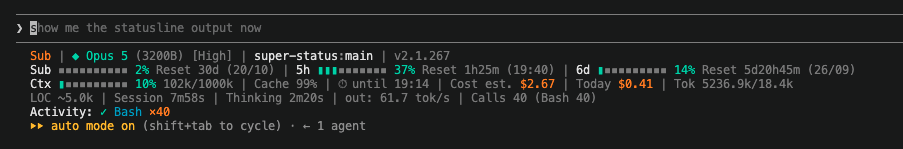

# super-status

A unified statusline for **Claude Code** and **Google Antigravity CLI (`agy`)** — identity, active agents, context usage, session quality, plan-limit tracking, and (optionally) live tool activity, running subagents, todo progress, and `/orca`/`/master` wave state, in a compact, visually hierarchical layout at the bottom of every session.



## Requirements

Supported platforms: **macOS**, **Linux**, and Windows via **WSL** or **Git Bash** (plain Windows without a bash environment is not supported — this is a bash script by design).

| Binary | Required? | Used for |
|---|---|---|
| `bash` | required | the script itself |
| `jq` | required | stdin/config JSON parsing |
| `python3` | required | transcript parsing (`Tok`, `Calls`, `Activity:`, `Agents:`, `Todo:`) — ships by default on macOS and most Linux distros |
| `git` | recommended | branch, dirty/ahead-behind markers |
| `timeout` | recommended | the time limit on every `git`/`jj` call. GNU coreutils; on macOS it is `gtimeout` from `brew install coreutils`. Without either, git runs unbounded and a stalled repository can freeze the statusline |
| `tokei` | optional | the `LOC` (lines of code in project) field |
| `curl` | optional | the OpenRouter `Bal` bar (Mode 3 only) |
| `jj` | optional | [Jujutsu](https://github.com/jj-vcs/jj) branch state, behind `jj.enabled` (Mode: any) |

```
brew install jq
brew install tokei
```

## Install

### Option A — as a Claude Code plugin (four in-session commands)

```
/plugin marketplace add orassayag/super-status
/plugin install super-status
/super-status:setup
```

The `setup` command copies the script into `~/.claude/super-status/`, makes it executable, and patches `statusLine` in `~/.claude/settings.json` for you (backing the file up first).

### Option B — one command from a clone

```
git clone https://github.com/orassayag/super-status.git
cd super-status
bash install.sh
```

`install.sh` does the same copy + chmod + settings patch, resolving your home directory itself — no placeholder paths to edit. It preserves an existing `refreshInterval` and defaults it to `2` otherwise.

### Option C — manual fallback

```
mkdir -p ~/.claude/super-status
cp statusline.sh ~/.claude/super-status/statusline.sh
chmod +x ~/.claude/super-status/statusline.sh
```

Then add this to `~/.claude/settings.json` (create the file if it doesn't exist), with your actual home directory in the path:

```
{
  "statusLine": {
    "type": "command",
    "command": "/bin/bash /home/YOUR_USER/.claude/super-status/statusline.sh",
    "refreshInterval": 2
  }
}
```

This is the **user-level** settings file, so it applies to every project automatically — no per-project setup needed. `refreshInterval` (seconds) is optional but recommended — see **Live updates** below for why.

### Google Antigravity CLI (`agy`) setup

Add this to `~/.gemini/antigravity-cli/settings.json`:

```json
{
  "statusLine": {
    "command": "/bin/bash /home/YOUR_USER/.claude/super-status/statusline.sh",
    "enabled": true
  }
}
```

Or configure it interactively inside any active `agy` session:

```text
/statusline ~/.claude/super-status/statusline.sh
```

### Open a new session

The statusline configuration is read at startup — it won't appear in a session that was already running when you edited `settings.json`. Close your current session and open a new one.

If it still doesn't appear after that, Claude Code may be waiting for workspace trust to be accepted for your working directory. Run `claude` once in that directory and accept the trust prompt when asked, then restart again.

**Quick test without Claude Code:**

```
echo '{"model":{"display_name":"Opus"},"workspace":{"current_dir":"/home/you/myapp"},"context_window":{"used_percentage":25}}' \
  | bash ~/.claude/super-status/statusline.sh
```

If you see formatted, colored lines, it's working. (Fields that need a live session — like rate limits, token totals, or `Calls` — won't show with this minimal mock payload; that's expected, see "What each field means" below.)

## Output format

super-status prints a compact, visually hierarchical layout: one identity line, one usage-bar line, one session-cost line, and one muted diagnostics line. Every bar on every line is the same fixed width, so stacked bars and their `%` values align in a column. The exact number of lines shown depends on the backend mode (see **Backend modes** below) and your configuration, but the fields and their order are always the same.

**Mode 1 — Anthropic subscription (4 lines by default):**

```
◆ Claude Sonnet 4.6 | repo:master | +45 -12 | v2.1.90
Sub ▮▮▮▮▮▮▪▪▪▪ 62% Reset 14d (08/08) | 5h ▮▮▮▮▮▮▮▮▮▪ 99% Reset 2h30m (16:30) | 3d ▮▮▮▮▪▪▪▪▪▪ 44% Reset 3d14h10m (21/07)
Ctx ▮▮▮▮▪▪▪▪▪▪ 42% 84k/200k | Cache 71% | Cost est. $1.23 | Tok 152.3k/45.2k
LOC ~14.2k | Session 1h30m | Thinking 1m38s | Eff A(100) | Calls 9 (Bash 1, Read 3, Code 3, Skill 1, Other 1)
```

- **Line 1 — identity:** model (accent color), `repo:branch`, lines added/removed this session (hidden when both are zero), Claude Code version.
- **Line 2 — usage bars:** subscription cycle, 5-hour window, weekly window — each as `label bar % reset`.
- **Line 3 — session cost:** context usage, cache-reuse %, session cost, cumulative in/out tokens.
- **Line 4 — diagnostics:** all muted gray — project LOC, session/thinking time, efficiency grade, and one consolidated tool-call clause.

With `"preset": "full"` in the config (see **Configuration**), up to four more lines appear when they have something to show, and the branch gains live git markers:

```
◆ Claude Sonnet 4.6 | repo:master* ↑2 !3 +1 ?2 | ...
...
Activity: ◐ Edit: auth.ts | ✓ Read ×3 | ✓ Grep ×2
Agents: ◐ Explore [haiku]: Finding auth code (2m15s)
Todo: ▸ Fixing authentication bug (2/5)
Orca: 3/6 merged | 2 in progress | 1 conflict ⚠
```

The `Sub` bar needs a one-time setup step — see **Subscription tracking setup** below. Until then it's replaced by a bold red reminder line.

**Mode 2 — Anthropic API key / other pay-as-you-go (3 lines — Sub/5h/Nd bars omitted):**

```
◆ Claude Sonnet 4.6 | repo:master | +45 -12 | v2.1.90
Ctx ▮▮▮▮▪▪▪▪▪▪ 42% 84k/200k | Cache 71% | Cost $3.42 | Tok 152.3k/45.2k
LOC ~14.2k | Session 1h30m | Thinking 1m38s | Eff A(100) | Calls 9 (Bash 1, Read 3, Code 3, Skill 1, Other 1)
```

On a non-Anthropic backend (e.g. z.ai), the model segment carries an explicit provider badge: `◆ Claude Sonnet 4.6 [z.ai]`.

**Mode 3 — OpenRouter (4 lines — the usage-bar line shows a live `Bal` bar instead):**

```
◆ anthropic/claude-sonnet-4.6 [OpenRouter] | repo:master | +45 -12 | v2.1.90
Bal ▮▮▪▪▪▪▪▪▪▪ 17% $16.58/$20.00
Ctx ▮▮▮▮▪▪▪▪▪▪ 42% 84k/200k | Cost $3.42 | Tok 152.3k/45.2k
LOC ~14.2k | Session 1h30m | Thinking 1m38s | Eff A(100) | Calls 12 (Bash 3, Read 2, Code 4, Skill 1, MCP 2)
```

**Colors carry meaning, not decoration:** green = healthy / well within limits (the same accent family as the model name), orange = approaching a threshold, red = at/near the limit, and muted gray = purely informational (version, cache %, token counts, the whole diagnostics line). Warning colors are never used on non-actionable fields. Every bar (`Sub`, `5h`, `Nd`, `Ctx`, `Bal`) is colored to match its own usage percentage; the thresholds are configurable (see **Configuration**).

**Reset strings:** each reset is a relative countdown followed by an absolute "when" marker in parentheses, so a glance shows both how long and when. The marker is a clock time `(HH:MM)` when the reset lands on today's date (`Reset 2h30m (16:30)`), and a date `(dd/MM)` when it lands on a later day (`Reset 3d14h10m (21/07)`). Every reset — `Sub`, `5h`, and the weekly window — carries one.

## Configuration

Everything is optional. With no config file, super-status renders its default layout; the new-in-2.0 elements (`Activity:` / `Agents:` / `Todo:` lines, git dirty/ahead-behind/file-stat markers) default **off**.

Create `~/.claude/super-status/config.json`. The quickest start:

```json
{ "preset": "full" }
```

A malformed config never breaks the render — defaults are used and a one-line bold red warning appears until it's fixed. Unknown keys are ignored.

### Full reference (every key, with its default)

```json
{
  "preset": "",
  "language": "en",
  "layout": "expanded",
  "lines": [],
  "right_align": [],
  "bar_width": 10,
  "bar_filled": "▮",
  "bar_empty": "▪",
  "path_levels": 1,
  "max_width": 0,
  "context_value": "both",
  "auto_compact_window": 0,
  "model_source": "stdin",
  "model_params": {},
  "external_usage_path": "",
  "external_usage_max_age": 1800,
  "external_usage_write_path": "",
  "prompt_cache_ttl_seconds": 300,
  "hyperlinks": false,
  "added_dirs_max": 5,
  "added_dirs_name_width": 24,
  "added_dirs_layout": "inline",
  "plan_label": "",
  "api_credit_balance": null,
  "api_credit_as_of": "",
  "api_spend_cache_seconds": 300,
  "model_pricing": {},
  "display": {
    "model": true, "mode": true, "repo": true, "branch": true, "worktree": true,
    "lines_changed": true, "version": true, "provider": true, "effort": true,
    "git_dirty": false, "git_ahead_behind": false, "git_file_stats": false,
    "subscription": true, "sessions": true, "balance": true,
    "context": true, "cost": true, "total_tokens": true,
    "loc": true, "session_time": true, "thinking_time": true,
    "cache_ratio": true, "efficiency": true, "tool_calls": true,
    "activity": false, "agents": false, "todos": false, "orchestrator": false,
    "added_dirs": false, "prompt_cache": false, "today": false,
    "compactions": false, "speed": false
  },
  "git": {
    "push_warning_threshold": 3,
    "push_critical_threshold": 10,
    "timeout_seconds": 3
  },
  "jj": {
    "enabled": false
  },
  "colors": {
    "label": "", "model": "", "repo": "", "branch": "",
    "muted": "", "accent": "", "bar_filled": "", "bar_empty": ""
  },
  "thresholds": {
    "context_warning": 70, "context_critical": 90,
    "five_hour_warning": 70, "five_hour_critical": 90,
    "seven_day_warning": 50, "seven_day_critical": 75
  }
}
```

| Key | Meaning |
|---|---|
| `preset` | `full` (everything on), `essential` (identity + git + limits + context + todos/agents), or `minimal` (model, branch, context, sessions — compact layout). Applied first; every explicit key below still overrides it |
| `language` | Label language. Only `en` ships; all labels live in one block in the script, so adding a language is one `case` branch |
| `layout` | `expanded` (the default multi-line layout) or `compact` (3 lines for small panes — see **Compact layout** below) |
| `lines` | An array of arrays of segment names that replaces the preset layout entirely — this is how segments are reordered or merged onto shared lines. See **Custom layout** below. Empty = use the `layout` preset |
| `right_align` | Segment names at which a line's right-aligned run **begins**, e.g. `["context"]`. On whichever line that segment renders, it and everything after it are pushed to the right edge, giving a fixed right-hand column that does not slide when the left-hand text changes length. Stands down to an ordinary left-packed line whenever the terminal width is unknown or there is no room to pad. Empty = every line packs left |
| `bar_width` | Progress-bar width in glyphs (5–60). The default `10` keeps every bar the same width so stacked bars align in a column |
| `bar_filled` / `bar_empty` | Bar glyphs. The defaults (`"▮"` / `"▪"`) give a segmented block bar; set e.g. `"█"` / `"░"` for a solid bar, or `"#"` / `"-"` for ASCII-only terminals |
| `path_levels` | How many trailing path components the repo location shows (1–5). `2` turns `client:main` into `acme/client:main`, disambiguating same-named folders |
| `max_width` | Truncate each line to this display width with a trailing `…` (ANSI- and UTF-8-aware). `0` = only truncate when `$COLUMNS` is exported to the script |
| `context_value` | What renders on the `Ctx` segment next to the bar: `percent`, `tokens`, `remaining` (tokens left before auto-compact — uses Claude Code's own `remaining_percentage` when present), or `both` |
| `auto_compact_window` | When set to a positive token count (e.g. `160000`), the `Ctx` percentage and `used/max` are measured against this window instead of the full model window, so the figure matches what `/context` shows (which counts against the auto-compact threshold). `0` = disabled |
| `model_source` | Where the model **name** comes from: `stdin` (trust Claude Code's `display_name`, the default), `transcript` (always read the real model id from the session transcript), or `auto` (use the transcript only when a non-Anthropic backend is detected). Useful behind a proxy that rewrites the model name — raw ids like `claude-sonnet-4-6-20250101` are humanized to `Claude Sonnet 4.6` |
| `model_params` | Parameter-count badge shown after the model name (`◆ Sonnet 5 (365B)`). A map from a case-insensitive **substring of the displayed model name** to the text to render, e.g. `{"sonnet 5": "365B", "opus 5": "2T"}`. The longest matching pattern wins, so a specific `"sonnet 5"` beats a broader `"sonnet"`. Empty (the default) = no badge — Anthropic publishes no parameter counts, so these numbers are yours to declare, not a built-in table |
| `external_usage_path` | Path to a local JSON file another tool writes with the same shape as stdin's `rate_limits` (optionally plus a `model_scoped` map of per-model weekly windows). When stdin omits `rate_limits`, a fresh snapshot fills the `5h`/`Nd` bars from session start and renders any per-model windows. Supports a leading `~/`. Empty = disabled |
| `external_usage_max_age` | Freshness cap in seconds for `external_usage_path` (default `1800`). A snapshot older than this is ignored, so a stale file never resurrects a rolled-over window. `0` = never expire |
| `external_usage_write_path` | The producer side of the above. When Claude Code hands the script real `rate_limits` on stdin, they are also written to this file — so `usage-feeder.sh`, whose data source is throttled, usually finds recent data already waiting and has to poll less. Must be an **absolute** path ending in `.json` whose directory exists (a leading `~/` is expanded); written `0600`, staged through a temp file, and **only when the new windows are not older than what the file already holds**, so the bars can only ever move forward. Empty = disabled |
| `prompt_cache_ttl_seconds` | Fallback cache lifetime, in seconds, for the `⏱ until HH:MM` expiry segment (default `300`, minimum `60`). Only used for transcripts that record no cache tier at all — a transcript that reports a 5-minute or 1-hour cache write always wins over this |
| `hyperlinks` | `true` makes the file name on the `Activity:` line an OSC 8 terminal hyperlink that opens the file. Off by default: terminals without hyperlink support can print the raw escape sequence as visible junk. The address is built from the absolute path in the transcript, sanitized and percent-escaped before it is emitted — a path that is not absolute renders as plain text instead |
| `added_dirs_max` | How many `/add-dir` directories render before the rest collapse to `+N more` (1–20, default `5`) |
| `added_dirs_name_width` | Each added directory's name is cut to this many characters (4–80, default `24`) |
| `added_dirs_layout` | `inline` (the default) puts them on the identity line beside the project name — `super-status:main +shared-lib`; `line` gives them a row of their own — `Added dirs: shared-lib, other-thing`. Only the `line` form is addressable as an `added_dirs` segment in a custom `lines` layout; the `inline` form attaches to whichever identity segment rendered |
| `plan_label` | Overrides the account-mode badge, the first segment on the identity line (`API \| ◆ Opus 5`). Empty (the default) auto-detects — see **Account-mode badge** below. Set it to whatever you want rendered: `"Max 20x"`, `"Pro"`, `"Team"` |
| `api_credit_balance` | Your prepaid credit balance in USD, read off the Console's **Credit balance** card, e.g. `96.49`. Turns on the `Bal` bar in API mode. `null` (the default) = the whole feature is inert — see **Prepaid API credit bar** below |
| `api_credit_as_of` | When `api_credit_balance` was read, as `dd/MM/yyyy` or `dd/MM/yyyy HH:MM`. Required whenever a balance is declared; an absent or malformed value warns rather than guessing. **Prefer the `HH:MM` form for a balance you just read** — a bare date means midnight, so stamping an afternoon reading as today makes the bar re-subtract everything already spent that day. `/super-status:credits` writes the clock time for you; the bare-date form is for backdating a past top-up, where midnight is the right reading |
| `api_spend_cache_seconds` | How long a fetched spend total is reused before a refresh is spawned (default `300`, minimum `60`). Anthropic's cost data lands ~5 minutes behind the request, and the endpoint asks for at most one poll a minute, so going below a few minutes buys nothing |
| `model_pricing` | Per-MTok list-rate overrides for the **local** spend estimate, as `{"<model-id substring>": "<input>/<output>"}` — e.g. `{"opus-5": "5/25"}`. Longest matching pattern wins, same rule as `model_params`. Empty (the default) uses the estimator's built-in table; override when Anthropic's rates move or you're on negotiated pricing. Has no effect on the Admin API figure, which is already in dollars |
| `display.*` | Per-field show/hide. Field names match the segment names under **Custom layout** below (plus `git_dirty` / `git_ahead_behind` / `git_file_stats` / `provider` / `effort` / `mode`, which are sub-toggles of `branch`/`model`) |
| `git.push_warning_threshold` / `push_critical_threshold` | Unpushed-commit counts at which the `↑N` marker turns orange / red |
| `git.timeout_seconds` | Seconds any single `git` (or `jj`) call may take before it is abandoned (1–60, default `3`). A statusline re-runs every couple of seconds, so a git call blocked on a stalled network mount does not just delay one render — it queues stuck processes behind every following one. A timed-out call degrades to the same "no repository here" the script already handles. Requires `timeout` (Linux) or `gtimeout` (`brew install coreutils`); with neither present git runs unbounded, exactly as before |
| `jj.enabled` | `true` opts into [Jujutsu](https://github.com/jj-vcs/jj). One version control system per repository, never both: jj takes over only when this flag is set **and** a real `.jj` control directory exists at or above the working directory, so a stray `.jj` inside an ordinary git repository cannot cost that repository its branch name. Shows the bookmark (or the short change id), a `*` dirty marker, and a red `⚠` for an unresolved conflict. Every jj call uses `--ignore-working-copy`, so the statusline never snapshots — it is strictly read-only |
| `colors.*` | Per-element color overrides: named ANSI (`red`, `cyan`, `grey`, `bright-blue`, `orange`, ...), 256-color numbers (`"208"`), or hex (`"#ff8800"`). Empty = built-in default |
| `thresholds.*` | Percentages at which the context / 5-hour / weekly bars turn orange (warning) and red (critical) |

### Compact layout

`"layout": "compact"` collapses the default multi-line output down to 3 lines for small terminal panes (cmux splits especially) — same fields, same colors, just packed onto fewer lines instead of the default `expanded` layout's 4–8:

```json
{ "preset": "full", "layout": "compact" }
```

```
◆ Claude Sonnet 4.6 | repo:master | Ctx ▮▮▮▮▪▪▪▪▪▪ 42% 84k/200k
Sub ▮▮▮▮▮▮▪▪▪▪ 62% Reset 14d (08/08) | 5h ▮▮▮▮▮▮▮▮▮▪ 99% Reset 2h30m (16:30) | 3d ▮▮▮▮▪▪▪▪▪▪ 44% Reset 3d14h10m (21/07) | Cost est. $1.23
Activity: ◐ Edit: auth.ts | ✓ Read ×3 | ✓ Grep ×2
```

Any line that ends up with nothing to show (e.g. the `Sub`/`5h`/`Bal` bars all empty, or no agents/todos in flight) is omitted, so the actual line count can be 1–3 depending on backend mode and what's active. `layout` and `preset` are independent — `compact` works with any preset, including no preset at all.

### Custom layout

`lines` (an array of arrays of segment names) replaces the preset layout entirely — this is how you reorder segments or merge them onto shared lines:

```json
{
  "lines": [
    ["model", "branch", "context"],
    ["sessions", "balance"],
    ["todos", "agents"]
  ]
}
```

Segment names: `mode`, `model`, `agent` (Antigravity CLI only — the active agent's name and subagent count), `repo`, `branch`, `worktree`, `added_dirs`, `lines_changed`, `version`, `subscription`, `sessions`, `balance`, `context`, `cache_ratio`, `prompt_cache`, `cost`, `today`, `total_tokens`, `loc`, `session_time`, `thinking_time`, `speed`, `efficiency`, `tool_calls`, `compactions`, `activity`, `agents`, `todos`, `orchestrator`. Empty segments are dropped along with their separator, and fully empty lines are omitted — so listing `sessions` and `balance` on the same line is safe (only one ever renders).

### Right-aligned run

`right_align` names the segment at which a line's right-hand run starts. Everything from that segment onward is pushed to the right edge, so the right-hand column stays put as the branch name changes length:

```json
{
  "lines": [["model", "repo", "context", "cost"]],
  "right_align": ["context"]
}
```

```
◆ Claude Sonnet 4.6 | super-status:main        Ctx ▮▮▮▮▪▪▪▪▪▪ 42% | Cost est. $1.23
```

It stands down — falling back to the ordinary left-packed line — whenever the terminal width is unknown (`$COLUMNS` not exported and no `max_width` set) or the two runs together already fill the line. A wrapped statusline costs a whole row, which is strictly worse than an unaligned one.

### Kill switch

`SUPER_STATUS_DISABLE=1` makes the script exit silently for that session — no config changes needed. Useful for screenshots or debugging.

## Live updates

super-status is a stateless script — it only knows what Claude Code hands it on stdin *at the moment it's invoked*. That has a few visible effects that are Claude Code behavior, not bugs in this script:

- **The statusline disappears during permission prompts, autocomplete, and the help menu.** This is documented, intentional Claude Code behavior — it hides in those moments and reappears once you respond.
- **`Session` (session time) and `Thinking` (thinking time) can appear frozen.** By default, Claude Code only re-runs your statusline command after a new assistant message, after `/compact`, when the permission mode changes, or when vim mode toggles — there's no built-in per-second tick. So during a long thinking pause or while waiting on a tool call, both fields hold their last value until the next one of those events fires.
- **Rate-limit data (the `5h`/`Nd` bars) and cumulative session token totals (`Tok`) are both empty until after your first message exchange in a session.** Claude Code only populates `rate_limits` and `context_window.total_input_tokens` / `total_output_tokens` once it's made at least one real API call — there's currently no way to see them before that (this is the single most-requested statusLine feature upstream, [tracked here](https://github.com/anthropics/claude-code/issues/27915)). If you see the `5h`/`Nd` bars appear without having typed anything yourself, it's because *something* triggered a background API call (e.g. reloading MCP servers rebuilds the system prompt and does a round-trip) — not because super-status found a way around the limitation. Two things soften this: the last-seen values are cached to disk and restored across `/clear` and fresh sessions (while the cached reset is still in the future), and you can point `external_usage_path` at a JSON snapshot maintained by a separate zero-token job to seed the bars — and per-model weekly windows — from session start.
- **The permission-mode indicator (`⏵⏵ auto mode on ...`) disappears while Claude is thinking.** That line is Claude Code's own footer, not part of super-status — Claude Code temporarily replaces it with the thinking spinner (`✻ ... esc to interrupt`) while a response is being generated, and it comes back when the turn ends. Normal, and nothing a statusline script can influence.
- **A `5h` percentage above 100% (e.g. `108%`) is expected, not a bug.** Anthropic's own usage accounting can briefly overshoot the limit before Claude Code cuts a session off (e.g. a burst of concurrent or cached requests landing faster than the limit check). super-status prints the percentage exactly as reported rather than silently clamping it to 100 — only the bar's fill width is clamped, so the bar still reads as "full."
- **The `Activity:` and `Agents:` lines update when the transcript does.** In-flight markers (`◐`) appear as soon as Claude Code records the tool call and clear when its result lands; elapsed times on agents tick with each re-render, so `refreshInterval` makes them feel live.
- **The `Orca:`/`Master:` line is different — it's read straight off disk, not the transcript, so it stays live even while this session is idle.** `/orca` and `/master` (a [personal workflow](https://github.com/orassayag/agentic-project-workflow)) spawn wave agents as separate cmux-worktree processes with their own transcript, so nothing about them ever appears in *this* session's stdin JSON — the orchestrator session can be sitting there blocked on a tool call with no way to know a wave finished. `.claude/status.md` and `docs/status/stage-plan.md` are the on-disk files those tools already treat as their own source of run state, updated as the wave progresses rather than only once it's done — so with `refreshInterval` set, this line ticks in near-real-time independent of whether the orchestrator's own turn has ended.

To make the time fields update continuously instead of only on those events, add `"refreshInterval": 2` (or any value in seconds, minimum `1`) to the `statusLine` block in `~/.claude/settings.json` (the installers do this for you). This re-runs the script on a fixed timer in addition to the normal event triggers, so the clock keeps ticking even while Claude is idle or thinking. The script's warm-path render is a single `jq` pass over stdin plus cached transcript/git reads, so even `"refreshInterval": 1` is comfortable.

## What each field means

### Line 1 — Identity

| Field              | Example             | Meaning                                                                |
| ------------------ | -------------------- | ----------------------------------------------------------------------- |
| `<mode>` | `API` | How the account is billed, as the identity line's own leading segment — `API` on prepaid/invoice credit billing, or your subscription tier (`Pro`, `Max 20x`, or plain `Sub`). See **Account-mode badge** below; `plan_label` overrides it and `display.mode` turns it off. Addressable as the `mode` segment in a custom `lines` layout |
| `◆ <model>` | `◆ Claude Sonnet 4.6` | The model powering the current session, in the accent color. A `model_params` entry adds its parameter count after the name (`◆ Sonnet 5 (365B)`). On a non-Anthropic backend a provider badge is appended (`[OpenRouter]`, `[z.ai]`, `[Bedrock]`, `[Vertex]`, or the backend's hostname). Bedrock/Vertex are detected from `CLAUDE_CODE_USE_BEDROCK`/`CLAUDE_CODE_USE_VERTEX` (or a matching base URL). When Claude Code reports a reasoning-effort level (`low`/`medium`/`high`/`xhigh`/`max`), it's appended last as `[High]`; models that don't support the effort parameter show no badge. With `model_source` set, the name can be recovered from the transcript when a proxy rewrites it |
| `repo:branch/worktree` | `repo:master* ↑2 ↓1 !3 +1 ?2` | Current project folder, git branch (resolved from your working directory's git root), and — only inside a git worktree — the worktree name after a `/`. `path_levels` shows more of the repo path. With the git toggles enabled: `*` = dirty working tree; `↑N`/`↓N` = commits ahead/behind upstream (`↑` colored by the push thresholds); `!N +N ?N` = modified / staged / untracked file counts (only non-zero ones shown). Refreshed at most every 10s |
| `+N -M`            | `+45 -12`             | Lines added/removed this session, taken directly from Claude Code's own `cost.total_lines_added`/`total_lines_removed` counters — updates immediately on every render, no caching. Only counts edits made by this session's own tools (not sub-agents running in their own sessions, and not nested-repo work outside the current one). Hidden if both are zero |
| `vX.Y.Z`           | `v2.1.90`             | Claude Code CLI version (muted — informational)                        |

### Line 2 — Usage bars (backend-dependent — see Backend modes below)

| Field | Example                                | Meaning                                                                                                                                                                                                                              |
| ----- | --------------------------------------- | ------------------------------------------------------------------------------------------------------------------------------------------------------------------------------------------------------------------------------------ |
| `Sub` | `▮▮▮▮▮▮▪▪▪▪ 62% Reset 14d (08/08)`      | How far through your current monthly billing cycle you are, with days remaining until renewal (rounded up) and the renewal `(dd/MM)` in parens. Cycles are true calendar months from your declared start date (14/07 renews on 14/08 — 28–31 days depending on the month; a start day missing from a shorter month, e.g. the 31st, clamps to that month's last day). Green early in the cycle, orange mid-cycle, red in the final ~2 days — informational progress, not a rate-limit warning. Requires the one-time setup in **Subscription tracking setup** below; until then a bold red reminder line appears at the very top instead |
| `5h`  | `▮▮▮▮▮▮▮▮▮▪ 99% Reset 2h30m (16:30)`    | % of your rolling 5-hour Anthropic plan limit used, a usage bar colored to match, the countdown until reset, and the reset's absolute "when" marker in parens                                                                          |
| `Nd`  | `3d ▮▮▮▮▪▪▪▪▪▪ 44% Reset 3d14h10m (21/07)` | % of your rolling weekly Anthropic plan limit used. `N` is computed live — the actual number of days from now until the reset (rounded up) — not hardcoded to 7, since this window is rolling and doesn't always land exactly a week out. Like every reset, it carries an absolute "when" marker in parens: a clock time `(HH:MM)` if it lands today, a date `(dd/MM)` otherwise |
| `Bal` | `▮▮▪▪▪▪▪▪▪▪ 17% $16.58/$20.00`          | Remaining/total credit balance, bar and % colored to match usage. On **OpenRouter** both figures are live from `/api/v1/credits`. On **Anthropic API billing** the total is the balance you declared via `api_credit_balance` and the used portion is spend since `api_credit_as_of` — from the Admin API cost report, or estimated from local transcripts and marked `est.` when no Admin key is available. The `(as of dd/MM)` suffix names the snapshot the bar is measured against. See **Prepaid API credit bar** below |

Colors: green = healthy, orange = getting close, red = at/near the limit (the weekly window uses tighter thresholds than 5-hour, since a blown weekly quota is more disruptive than a 5-hour one that resets soon — both are configurable). A percentage above 100% can happen (see **Live updates** above) — it's shown as-is rather than clamped, though the bar itself always reads as full.

### Line 3 — Context, cache, cost, tokens

| Field      | Example                                 | Meaning                                                                                          |
| ---------- | ---------------------------------------- | -------------------------------------------------------------------------------------------------- |
| `Ctx` | `▮▮▪▪▪▪▪▪▪▪ 14% 28k/200k` | How full the context window is, with a usage-colored bar. Which value(s) render next to the bar is configurable via `context_value` — `percent`, `tokens`, `remaining` (`154k left` — often the most actionable number late in a session), or `both` |
| `Cache` | `71%` | How much of your current context came from cache reuse vs. fresh tokens. Higher = cheaper/more efficient session. Muted — informational, not actionable |
| `⏱ until` | `⏱ until 14:30` | When this session's prompt cache expires, as a **clock time** — or `⏱ expired` once past. Deliberately not a countdown: the statusline only repaints while Claude Code is active, so between turns (exactly when the cache is draining) a countdown freezes and keeps reporting a number that has stopped being true, while a clock time stays correct however stale the render is. The tier is read from the transcript's own cache write (5-minute vs. 1-hour); sub-agent responses are ignored, because they run against their own cache and never refresh this session's. Off by default (`display.prompt_cache`) |
| `Cost` / `Cost est.` | `$0.14`                    | Session cost in USD, always computed at standard API list rates. On API-key/OpenRouter mode this is real spend, labeled `Cost`. On subscription mode you pay a flat monthly fee regardless, so the same number is only an API-equivalent estimate of what the session *would* have cost — labeled `Cost est.` to make that explicit |
| `Today` | `$12.34` | Total spend across **every** session today, not just this one — the figure you actually budget against. `Cost` resets on every `/clear`, so three clears into a working day it reads low while the day's real total is several times that. Kept in a small per-day ledger under the cache root, one row per session, recording each session's cost the first time that day sees it — so enabling it mid-session counts only what you spend from then on, and a session crossing midnight is split across the two days. Rows unseen for more than a day are pruned on every write. Off by default (`display.today`) |
| `Tok`  | `152.3k/45.2k`            | Cumulative input/output tokens for the **whole session** (`in/out`) — unlike the `Ctx` figure, this doesn't reset after `/compact`. Both figures are computed by super-status itself, by summing every assistant message's usage fields out of the session transcript (input + cache-creation + cache-read tokens for `in`, output tokens for `out`), rather than trusted straight from Claude Code's own JSON — its `total_input_tokens` is unreliable early in a session and `total_output_tokens` only reflects the *last* exchange rather than a running total. Cached per `session_id`, re-parsed only when the transcript file's mtime changes. Empty until after your first message exchange (see **Live updates**) |

### Line 4 — Diagnostics (all muted gray)

| Field | Example | Meaning                                                                     |
| ----- | ------- | ---------------------------------------------------------------------------- |
| `LOC` | `~14.2k`  | Approximate lines of code in the project (via `tokei`, refreshed every 60s) |
| `Session` | `1h30m` | Total session wall-clock time                                              |
| `Thinking` | `1m38s` | Cumulative time spent waiting on model responses this session              |
| `Eff` | `A(100)` | Efficiency grade (A–F), based on how much code changed per *edit-capable* tool call (`Edit`, `Write`, etc. — read-only tools like `Read`/`Grep` don't count against it). Higher = more productive tool usage. The grade keeps its A/B green, C orange, D/F red coloring — it's the one non-gray value on this line. Omitted entirely until the session has made at least one edit-capable call, rather than showing a misleading `F(0)` during exploration |
| `out:` | `out: 42.1 tok/s` | Output rate of the last response. A cumulative token total still climbs at any speed, so a response generating at a third of its usual rate looks identical to a fast one — a degraded endpoint or a throttled account shows up here and nowhere else. Derived from the last response's output tokens and the transcript's own timestamps; nothing renders when that interval is not trustworthy (the first response of a session, or after a long idle gap). Off by default (`display.speed`) |
| `Compactions:` | `Compactions: 3` | How many times the context has been emptied this session. `Ctx 40%` reads comfortable either way, but at 40% *after three compactions* the conversation has lost most of its history and is heading for a fourth — the moment to start fresh rather than push on. Hidden until the first compaction, like `Calls` and `Eff`. Off by default (`display.compactions`) |
| `Calls` | `9 (Bash 1, Read 3, Code 3, Skill 1, Other 1)` | Every tool call this session, parsed from the transcript and grouped into six semantic buckets (mapping below). `9` is the session's total tool-call count, and the buckets always sum to exactly that total — zero buckets are simply not spelled out |

> **Note:** `Cache` and `Eff` are *custom heuristics* built for this project, not official Claude Code metrics. They're a useful relative signal, not an absolute judgment of session quality.

The bucket mapping:

| Bucket     | Tool names that fall into it                                     |
|------------|------------------------------------------------------------------|
| `Skill`    | `Skill` (slash-command/skill invocations)                        |
| `Code`     | `Edit`, `Write`, `MultiEdit`, `NotebookEdit` (edit-capable tools) |
| `Bash`     | `Bash` (shell/command execution)                                 |
| `Read`     | `Read`, `Glob`, `Grep`, `LS` (read-only/inspection tools)         |
| `MCP`      | any tool name prefixed `mcp__` (third-party/MCP tool calls)      |
| `Other`    | anything not matched above (guaranteed catch-all — nothing silently disappears) |

The `Calls` clause is hidden entirely if no transcript is available yet, or before the session's first tool call.

### Lines 5–8 — Activity, Agents, Todo, Orchestrator (off by default — enable via config)

| Field | Example | Meaning |
|---|---|---|
| `Added dirs:` | `Added dirs: shared-lib, other-thing` | Extra working directories added with `/add-dir`, which Claude Code already hands the script on stdin. Without it, `/add-dir ../shared-lib` leaves line 1 reading exactly as before — nothing signals that the session can now edit a second project. At most `added_dirs_max` render, the rest collapse to `+N more`, and each name is cut to `added_dirs_name_width`. The default `inline` layout puts them on the identity line (`super-status:main +shared-lib`) instead of their own row. Off by default (`display.added_dirs`) |
| `Activity:` | `◐ Edit: auth.ts \| ✓ Read ×3 \| ✓ Grep ×2` | Live tool activity, newest first: `◐` marks a tool call still in flight (its result hasn't landed in the transcript yet), `✓` marks completed calls — consecutive calls of the same tool collapse into one `×N` group, single calls show their target (file basename, command name, or search pattern). Hidden before the first tool call |
| `Agents:` | `◐ Explore [haiku]: Finding auth code (2m15s)` | Every subagent currently in flight (a `Task`/`Agent` tool call with no result yet): its type, model (when specified), task description, and elapsed time since launch. One segment per agent; the whole line hides when no agent is running |
| `Todo:` | `▸ Fixing authentication bug (2/5)` | The current in-progress item from the session's latest todo list, plus completed/total counts. Falls back to the next pending item when nothing is in progress; hides when no todos exist |
| `Orca:` / `Master:` | `Orca: 3/6 merged \| 2 in progress \| 1 conflict ⚠` or `Master: Stage 2/5 IN PROGRESS — Core calculation engine (8m12s) \| 1 committed` | Live run state for the [`/orca` or `/master` workflow](https://github.com/orassayag/agentic-project-workflow), read directly from `.claude/status.md` / `docs/status/stage-plan.md` at the git root — not the transcript, so it updates even while this session is idle waiting on the wave (see **Live updates** below). `Orca:` buckets every task row by status (only non-zero buckets shown: merged, in progress, done, conflict, blocked) and hides once every row is `REBASED & MERGED`. `Master:` shows the lowest-numbered open stage, its status, and elapsed time since it was spawned, plus a running committed count; hides once every stage is `COMMITTED`. If both files are present (a stale leftover from a previous run of the other kind), `Orca:` wins |

## Backend modes

super-status detects which backend you're running Claude Code against and adjusts the usage-bar line accordingly. Detection is automatic — no configuration needed beyond your normal Claude Code setup.

### Mode 1 — Anthropic subscription

Detected when Claude Code's `rate_limits` data is present (i.e. you're authenticated against an Anthropic Max/Pro plan). Shows the `5h`/`Nd` usage bars with reset countdowns as described above, plus the `Sub` billing-cycle bar (after the one-time setup below). Cost is labeled `Cost est.` in this mode, since it's an API-equivalent estimate rather than real spend.

## Subscription tracking setup

The `Sub` bar tracks how far you are through your current monthly billing cycle. It can't be automatic: Anthropic exposes no billing or renewal date anywhere in the JSON Claude Code hands to statusline scripts — so you declare your subscription start date once, in a `CLAUDE.md` file, and super-status derives every subsequent monthly cycle from it.

**Setup (one line, once):** paste this into your CLAUDE.md — either the project-local `CLAUDE.md` at the repo root, or the global `~/.claude/CLAUDE.md` — with your own date:

```
<!-- "subscription_start_date": "14/07/2026" -->
```

- The date **must be dd/MM/yyyy** (day first — `14/07/2026`, not `07/14/2026`), matching every other date this script prints.
- The HTML-comment wrapper is recommended so the line doesn't clutter the rendered doc, but it isn't required — the key is matched anywhere in the file (comment, code block, or plain text).
- A project-local `CLAUDE.md` takes priority over the global one, so you can override per project if needed.

**Renewing (each new billing cycle):** after you purchase/renew, run the plugin command to reset the start date to today so the `Sub` cycle restarts from the renewal day — no hand-editing:

```
/super-status:subscribe
```

It rewrites the existing `subscription_start_date` in the first `CLAUDE.md` that has one (project-local first, then global), or adds it to `~/.claude/CLAUDE.md` if neither does. Pass a `dd/MM/yyyy` date to backdate it (e.g. you renewed yesterday):

```
/super-status:subscribe 06/08/2026
```

**If the key is missing from both files**, a bold red reminder appears as the very first line of the statusline until you add it:

```
SUBSCRIPTION START DATE IS MISSING - ADD IT TO THE CLAUDE.MD: "subscription_start_date": "dd/MM/yyyy"
```

**If the key is present but the value isn't a real dd/MM/yyyy date** (wrong format, or an impossible date like `31/02/2026`), the same line appears with `INVALID` instead of `MISSING`. Note that an invalid value in the local file is reported as-is — it does **not** fall back to the global file, since a broken local value is almost certainly a typo you'd want to know about rather than silently mask.

**Once a valid date is found**, the warning disappears and the `Sub` bar renders at the start of the usage-bar line:

```
Sub ▮▮▮▮▮▮▪▪▪▪ 62% Reset 14d (08/08)
```

This whole feature is subscription-mode only — API-key and OpenRouter users have no monthly cycle to track, so for them there's no warning, no bar, and no CLAUDE.md reads at all.

### Mode 2 — Anthropic API key or other pay-as-you-go backend (e.g. z.ai)

Detected when `rate_limits` is absent. There is still no rolling-window data to show here, so the `5h`/`Nd` bars stay omitted rather than rendering empty. On **Anthropic** API billing you can opt into a `Bal` credit bar — see **Prepaid API credit bar** below. On other pay-as-you-go backends `Cost` remains the primary usage signal (z.ai, for instance, documents only a dashboard view, no balance endpoint).

## Account-mode badge

The identity line leads with how the account is billed, so a session run on API credits never looks like a session run on a subscription:

```
API | ◆ Opus 5 (3200B) | super-status:main | v2.1.267
Max 20x | ◆ Opus 5 (3200B) | super-status:main | v2.1.267
```

Detection reads `~/.claude.json`'s `oauthAccount` — `billingType` (`prepaid`/`invoice` → `API`, `subscription` → a subscription) and `seatTier`, which names the tier when Anthropic publishes it. **`seatTier` is `null` on most accounts**, so a subscription with no published tier renders the neutral `Sub` rather than guessing between Pro and Max. To name yours, declare it once:

```json
{ "plan_label": "Max 20x" }
```

`plan_label` wins over everything detected. Two behaviors worth knowing:

- **Behind a proxy** (OpenRouter, Bedrock, Vertex, z.ai, any custom `ANTHROPIC_BASE_URL`) the badge is suppressed, because your Anthropic billing type says nothing about who is billed for that traffic — the `[provider]` badge speaks for the backend instead. An explicit `plan_label` still renders, so you can label a proxy setup yourself.
- **With no `~/.claude.json` and no `rate_limits`** there is nothing to detect from and the badge is simply absent, exactly as before this feature existed.

Turn it off with `{"display": {"mode": false}}`.

## Prepaid API credit bar

On Anthropic API billing, `Bal` answers the same question the `Sub` bar answers for subscribers: how much of what you paid for is left.

```
Bal ▮▮▪▪▪▪▪▪▪▪ 18% $79.12/$96.49 (as of 01/09)
```

**Why it needs setup.** Anthropic publishes no credit-balance endpoint — the Console's **Credit balance** card is not in the public API. Only *spend* is measurable. So the bar is built from two halves: a balance you declare, and spend measured forward from that moment.

**Setup — one command.** Read your balance off [the Console](https://platform.claude.com/settings/billing) and declare it (USD; a `$` and commas are fine):

```
/super-status:credits 102
```

That writes `api_credit_balance` and today's `api_credit_as_of` into `~/.claude/super-status/config.json`, backing up the previous file, and tells you which spend source you'll get. Pass a `dd/MM/yyyy` second argument to backdate a top-up you're recording late:

```
/super-status:credits 102 01/09/2026
```

Re-run it after every top-up. The cached spend total is keyed by the snapshot date, so moving the date discards the old total — no stale arithmetic.

### Where the spend figure comes from

Two sources, tried in that order:

**1. Admin API cost report** — authoritative, whole-organization, in real dollars. Needs an [Admin API key](https://platform.claude.com/settings/admin-keys) (`sk-ant-admin01-...`), a **different credential** from `ANTHROPIC_API_KEY` — a regular key is rejected:

```
export ANTHROPIC_ADMIN_KEY=sk-ant-admin01-...
```

Put that in your shell profile so every session inherits it. It's only ever sent to `api.anthropic.com/v1/organizations/cost_report`, read-only, never logged or written to disk. **Anthropic does not issue Admin keys to individual accounts** — the endpoint needs a real organization, so for most solo users this source is simply unavailable.

**2. Local transcripts** — the fallback, used automatically when there's no working Admin key. super-status prices your own Claude Code transcripts since the snapshot, at list rates, the same arithmetic behind the `Cost` field. It needs no credential and no network. It is an **estimate** and is labelled `est.` wherever it renders, because it can only see this machine's Claude Code traffic — Console playground calls, other tools on the same key, and other machines are invisible to it. Override the rate table with `model_pricing` if Anthropic's prices move before super-status does.

Messages are deduplicated on their API message id before pricing. Resuming or forking a session copies its history into a new transcript, and in a busy day close to half the assistant rows on disk are such copies — pricing each one inflates the estimate by nearly that much.

**What you get in each state:**

| State | Rendered |
|---|---|
| Balance declared, Admin key working | `Bal ▮▮▪▪▪▪▪▪▪▪ 18% $79.12/$96.49 (as of 01/09)` |
| Balance declared, no Admin key | `Bal ▮▮▪▪▪▪▪▪▪▪ 18% $79.12/$96.49 (est. · as of 01/09)` |
| Neither source available (no `python3`) | `Bal $96.49 (declared 01/09)` — the declared figure alone. No bar, because a bar with no spend figure would read 0% and quietly lie |
| Balance declared, snapshot missing or malformed | A bold red line at the top: `API CREDIT SNAPSHOT DATE IS MISSING OR INVALID - ...` |
| No balance declared | Nothing — the feature is fully inert, with no config reads, no scans, and no network calls |

**Caveats worth knowing:**

- The bar fills with what you have **spent**, like every other bar on the line — green early, red when the balance is nearly gone. Dollars remaining are in the text next to it.
- Cost data lands roughly **5 minutes** behind the requests it describes, so the bar trails live spend slightly either way. `api_spend_cache_seconds` (default `300`) sets how often it refreshes.
- The Admin report covers the **whole organization**, not just Claude Code — correct here, since so does the credit balance it's subtracted from. **Priority Tier spend is not in it**, so that portion goes uncounted.
- The Admin report is **daily-granular**, so on that source a mid-day snapshot still counts that whole UTC day. The local estimator honours `HH:MM` exactly. With an Admin key, declare the balance near the start of a day for the tightest figure.
- Both sources run **backgrounded, never inline**: each render prints the last completed result and, when it goes stale, spawns one refresh behind a lock. The statusline never blocks on the network or on a transcript scan.

### Mode 3 — OpenRouter

Detected via `$ANTHROPIC_BASE_URL` containing `openrouter.ai`. The `5h`/`Nd` bars are replaced with a **live `Bal` bar** pulled from OpenRouter's `/api/v1/credits` endpoint — both the remaining balance and the total are read live (never hardcoded), so top-ups are reflected automatically without any config changes. The bar is colored to match usage, same as the other modes.

**Requires:** an `OPENROUTER_API_KEY` environment variable available to the script (the same key you're already using for Claude Code's `ANTHROPIC_API_KEY`, or a separate one — either works, since it's only used read-only against the `/credits` endpoint, never logged or written anywhere). If this variable isn't set, super-status simply omits the `Bal` bar rather than erroring.

## A note on OpenRouter free models specifically

Everything above covers *paid* backends. If you're routing through OpenRouter to a free-tier model, a couple of things layer on top of Mode 3's behavior:

- **`Cost` will show `$0.00`**, and the balance bar will barely move — accurate, just not very informative on a free model.
- **`Cache` may sit permanently low.** Most free/non-Anthropic models don't support Anthropic-style prompt caching, so the cache-reuse percentage stays near zero — that reflects the backend's capabilities, not the quality of your actual session.

General reliability note: Claude Code is built and tested against Anthropic's first-party API. Routing through OpenRouter — especially to free, non-Anthropic models — isn't officially guaranteed to behave identically, and tool-calling reliability in particular varies a lot by model. If things look inconsistent, that's more likely the backend than the statusline.

## Caches

Everything super-status derives (LOC counts, transcript parses, git and jj status, the OpenRouter credits response, the Anthropic cost-report spend total, and the per-day ledger behind `Today`) is cached under `${XDG_CACHE_HOME:-$HOME/.cache}/super-status/`, created with `0700` permissions — private to your user, unlike the world-readable `/tmp` location used before v2.0.0. It's always safe to delete the whole directory; everything in it is re-derived on the next render — with one caveat worth knowing: deleting `daily-cost/` resets `Today` to zero for the rest of the day, because each session's baseline is re-recorded at its current cost. The day ledger prunes itself, dropping session rows unseen for more than a day on every write and sweeping day files older than two days on the first render of a new day. `doctor.sh` removes a legacy `/tmp/super-status` directory if it finds one.

## Troubleshooting

**Statusline disappeared after installing a plugin** — some plugins ship their own default config and can overwrite the `statusLine` key. Run the included doctor check:

```
bash ~/.claude/super-status/doctor.sh
```

This checks whether `~/.claude/settings.json` still points at the right script and re-patches it if not (it also verifies the executable bit, your config.json, and cache permissions).

**A field is empty and I want to know *why*** — `doctor.sh` answers "is the install correct", which is a different question. For a single render, set `SUPER_STATUS_DEBUG=1`:

```
SUPER_STATUS_DEBUG=1 bash ~/.claude/super-status/statusline.sh < payload.json 2>debug.log
```

It traces where each value came from — whether the rate-limit windows came from stdin, the cross-session cache, or nowhere; whether the transcript pass re-ran or reused its cache; what git resolved and whether a time limit was in force — and names every segment that came out empty. Everything goes to standard **error**, never standard output, so it cannot corrupt the statusline it is explaining. Unset, the script writes nothing to standard error at all.

**A field (or a whole line) shows nothing** — that's by design. Every field is hidden — label, value, and separator together — rather than showing `null`/blank placeholders when its data isn't available (e.g. `tokei` not installed, no git repo, no rate-limit data on a non-Anthropic backend, no transcript yet for `Calls`). If every field on a line is missing, the whole line is omitted rather than printing an empty line. The one exception is `Eff`, which is also deliberately hidden while the session hasn't made any edit-capable tool call yet — a grade of `F(0)` during pure exploration would be misleading, not informative. Also check your config: a `display.*` toggle or preset may simply have it off.

**`Activity:` / `Agents:` / `Todo:` / `Orca:` / `Master:` never show** — they're off by default. Add `{"preset": "full"}` (or the individual `display` toggles) to `~/.claude/super-status/config.json`, and note `Agents:`/`Todo:`/`Orca:`/`Master:` also hide whenever there's nothing in flight (no agent running, no todo list, or every task/stage already merged/committed).

**`Orca:` / `Master:` shows nothing even though a wave is running** — it reads `.claude/status.md` / `docs/status/stage-plan.md` from the git root of `cwd`/`project_dir`, so it needs to be run from (or under) the same directory `/orca`/`/master` was run in. It's also possible every row/stage happens to be in a terminal state (`REBASED & MERGED` / `COMMITTED`) at the moment of that particular render — the line only shows while something is still active.

**A bold red `SUPER-STATUS CONFIG IS INVALID JSON` line appears** — your `~/.claude/super-status/config.json` isn't parseable; the statusline is running on defaults until you fix or delete it. `bash ~/.claude/super-status/doctor.sh` confirms which.

**I want it gone for one session** — launch with `SUPER_STATUS_DISABLE=1` in the environment; the script exits silently without touching your config.

**The `5h`/`Nd` bars or `Tok` show nothing even though I'm on a subscription plan** — this is expected before your first message exchange in a session; see **Live updates** above. It should appear after your next turn.

**A bold red `SUBSCRIPTION START DATE IS MISSING/INVALID` line appears at the top** — that's the subscription-cycle feature asking for its one-time setup; see **Subscription tracking setup** above for the exact line to paste into your CLAUDE.md and the dd/MM/yyyy format it requires.

**`5h` shows a percentage over 100%** — expected; see **Live updates** above. Not a bug in this script.

**Nothing shows at all after a fresh install** — Claude Code skips statusLine execution until workspace trust is accepted for the working directory. If you've never run `claude` in that directory before, open a terminal there and run `claude` once to accept the trust prompt, then restart. After that, the statusline will appear in all subsequent sessions.

**Nothing shows at all (trust already accepted)** — test the script directly with the mock payload command in the "Quick test" section of Install. If that also produces nothing, check `chmod +x` was applied, that the path in `settings.json` is correct and absolute, and that `SUPER_STATUS_DISABLE` isn't exported somewhere.

**Nothing shows at all and hooks are disabled** — when Claude Code runs with hooks disabled (e.g. via the `--dangerously-skip-permissions` flag or the "Disable hooks" prompt in session), the statusLine is silenced along with all hooks. Re-enable hooks to restore the statusline.

**Statusline disappears during permission prompts, or Session Time / thinking time look stuck** — see [Live updates](#live-updates) above; both are expected Claude Code behavior, and the second is fixable with `refreshInterval`.

**Lines wrap on a narrow pane** — set `"max_width"` in the config (see **Configuration**), or switch to `"layout": "compact"`. Truncation kicks in automatically only when the terminal exports `$COLUMNS` to the script, which most statusline invocations don't.

**OpenRouter `Bal` bar isn't showing** — check that `OPENROUTER_API_KEY` is exported in the environment Claude Code runs in (not just your interactive shell — it needs to be set wherever the statusline script actually executes), and that `$ANTHROPIC_BASE_URL` contains `openrouter.ai`. You can sanity-check the API key works directly: `curl -s https://openrouter.ai/api/v1/credits -H "Authorization: Bearer $OPENROUTER_API_KEY"` should return your balance as JSON.

**`Calls` isn't showing** — it needs a `transcript_path` from Claude Code pointing at a readable JSONL file with at least one recorded tool call. On a session's very first render, before any tool has been used yet, this clause is correctly absent. Also requires `python3` to be on `PATH`.

## Development

```
bats tests/          # test suite (bats-core)
shellcheck statusline.sh doctor.sh install.sh
```

Both run in CI on macOS and Ubuntu (the script carries BSD/GNU dual paths for `date` and `stat`, so both platforms matter), plus a **non-blocking** `windows-latest` job that runs the suite under Git Bash — the README promises that platform, so something has to exercise it. It is non-blocking on purpose: a Windows runner is expected to surface real differences, and a permanently red required check is friction rather than information.

`tests/readme-options.bats` fails when the config keys `statusline.sh` reads and the keys this README's reference block documents disagree in **either** direction, so a key cannot ship undocumented and a row cannot outlive its key. When it fails, the fix is usually a README row.

Release history lives in [`versions/`](versions/), written by the commit hook — see [RELEASING.md](RELEASING.md). `CHANGELOG.md` is closed at 2.5.0 and points there. `docs/upgrade-plan.md` carries the design notes behind the 2.0 feature set.

| Also | |
|---|---|
| [CONTRIBUTING.md](CONTRIBUTING.md) | how to propose a change |
| [SUPPORT.md](SUPPORT.md) | what is supported, and the best-effort policy |
| [RELEASING.md](RELEASING.md) | every file a release touches |
| [SECURITY.md](SECURITY.md) | reporting a vulnerability |
| [CODE_OF_CONDUCT.md](CODE_OF_CONDUCT.md) / [MAINTAINERS.md](MAINTAINERS.md) | the short versions |
| [AGENTS.md](AGENTS.md) | one ordered install path, written for an agent asked to install this for someone |

## Thanks

super-status's cache-reuse percentage (`Cache`) and efficiency grade (`Eff`) were inspired by the custom scoring concept in [token-optimizer](https://github.com/alexgreensh/token-optimizer). The exact formulas here are our own heuristics (see §4 of `plan.md`), not a port of token-optimizer's internal logic, but the idea of grading a session's context/tool-call efficiency came from that project. Thanks a lot to [@alexgreensh](https://github.com/alexgreensh) for the inspiration.

The 2.0 feature set (live activity, subagents, todo progress, git enrichment, config presets, plugin packaging, and more) adopts ideas from [claude-hud](https://github.com/jarrodwatts/claude-hud) by [@jarrodwatts](https://github.com/jarrodwatts) — the issue-by-issue adoption plan lives in `docs/upgrade-plan.md`. The implementation here is independent (bash, not TypeScript), but the feature designs credit that project.

## License

MIT — see [LICENSE](LICENSE).

## A living project

super-status has already gone through two structural redesigns — first from a dense, symbol-heavy 3-line layout to a labeled multi-line format, then (v2.2.0) to the current compact, visually hierarchical layout with aligned 10-cell bars, short labels, and semantic-only color — and will keep iterating as fields get tuned, added, or adjusted based on real day-to-day use. The full history lives in [CHANGELOG.md](CHANGELOG.md); v2.0.0 added the config system, live activity/agents/todo lines, git status enrichment, private XDG caches, single-pass parsing, plugin packaging, and a CI-backed test suite.
